# 《绝区零》游戏膨胀分析

## 摘要

本文基于《绝区零》两种挑战关卡——**危局强袭战**（Hazard Zone）和**式舆防卫战**（Shiyu Defense）的计分机制，建立数学模型，分析怪物血量膨胀系数 $\alpha$ 对玩家最终得分的影响。

- **危局强袭战**：分数为**连续分段线性函数**，膨胀导致分数平滑递减，损失率取决于当前血条段的分数效率。
- **式舆防卫战**：分数为**时间加权积分**，倍率随时间衰减，膨胀通过延长首领战斗时段降低加权平均倍率。

本文通过分别分析两种挑战关卡下，以满分为目标和以拿满奖励为目标的玩家，随着怪物血量的膨胀，当前队伍的强度与能够保持目标的时间的关系

---

## 1. 基本假设与符号定义

### 1.1 通用假设

1. **不考虑环境变量**：忽略怪物出场动画、控制技交互等导致的输出时间失效。
2. **恒定输出模型**：将三人队伍简化为单一输出源，出伤速率（DPS）$D$ 为恒定值，不考虑击破失衡的爆发窗口。
3. **血量膨胀定义**：所有有血量敌人的血量统一膨胀 $(1+\alpha)$ 倍，普通敌人（被秒杀）血量视为0，不受膨胀影响。

### 1.2 符号表

| 符号 | 含义 | 单位 |
|:---:|:---|:---|
| $D$ | 玩家恒定输出速率（DPS） | 血量单位/秒 |
| $H$ | 怪物基准总血量 | 血量单位 |
| $\alpha$ | 血量膨胀系数 | 无量纲 |
| $T_{\text{full}}$ | 危局：无膨胀时打满60000分的时间 | 秒 |
| $T_{\text{base}}$ | 式舆：无膨胀时通关时间 | 秒 |
| $S$ | 最终得分 | 分 |

---

## 2. 危局强袭战（Hazard Zone）分析

### 2.1 计分机制

危局强袭战限时180秒，满分65000分（60000伤害分 + 5000技术分，技术分假设恒拿满）。

怪物共29条血（从外向内编号29→1），每段具有独立的血量倍率和分数奖励：

| 血条区间 | 血量倍率 | 分数 | 效率 $\eta$（分/血量） |
|:---:|:---:|:---:|:---:|
| 29–26 | 1.2 | 1000 | 833.33 |
| 25–22 | 1.7 | 1200 | **705.88**（低谷） |
| 21–18 | 2.2 | 1800 | 818.18 |
| **17–14** | **2.5** | **2400** | **960.00**（峰值） |
| 13–10 | 3.0 | 2600 | 866.67 |
| 9–7 | 5.0 | 2600 | **520.00**（最低） |
| 6–1 | 5.0 | 2700 | 540.00 |

总基准血量：$H_{\text{total}} = 87.4$（基准单位）

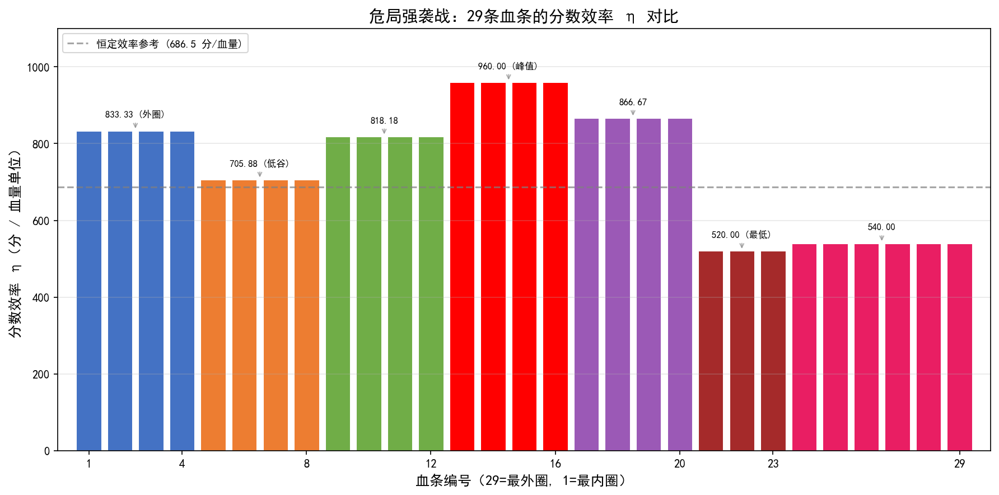

*上图展示了29条血条各自的分数效率 $\eta$。注意效率并非恒定——外圈（血条6–1）效率最低（520–540分/血量），中间血条（17–14）效率最高（960分/血量），差异接近2倍。这意味着在外圈血条上损失同样的HP输出，分数惩罚更严重。*

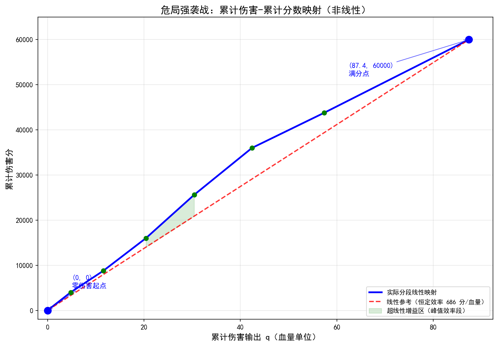

*上图展示了累计伤害（x轴）与累计伤害分（y轴）的分段线性映射关系。红色虚线为恒定效率参考线（从(0,0)到(87.4, 60000)），实际曲线在中段"弓起"——中间血条的单位伤害得分高于平均，而首尾血条低于平均。*

### 2.2 时间参数化

设玩家无膨胀时打满60000分所需时间为 $T_{\text{full}}$（秒）。

玩家DPS：$D = 87.4 / T_{\text{full}}$

180秒内原始总输出：$Q = D \times 180 = 87.4 \times 180 / T_{\text{full}} = 15732 / T_{\text{full}}$

**关键洞察**：$T_{\text{full}}$ 越小，玩家DPS越高，强度越强。

- $T_{\text{full}} = 180\text{s}$：刚好在限时内打满
- $T_{\text{full}} = 90\text{s}$：提前一半时间打满，DPS是前者的2倍
- $T_{\text{full}} = 30\text{s}$：提前5/6时间打满，DPS是前者的6倍

### 2.3 分数函数

膨胀后，怪物血量变为 $(1+\alpha)$ 倍，打满所需时间变为 $(1+\alpha) \cdot T_{\text{full}}$。

若 $(1+\alpha) \cdot T_{\text{full}} > 180$，则限时内无法打满，分数低于65000。

**总分函数**：

$$
S_{\text{HZ}}(\alpha) = F\left(\frac{15732}{(1+\alpha) \cdot T_{\text{full}}}\right) + 5000
$$

其中 $F(q)$ 为分段线性伤害分数映射。

### 2.4 临界膨胀系数

#### 2.4.1 满分临界（刚好65000分）

刚好在180秒限时内打满的条件：

$$
(1+\alpha) \cdot T_{\text{full}} = 180 \quad \Rightarrow \quad \boxed{\alpha_{\text{full}} = \frac{180}{T_{\text{full}}} - 1}
$$

**核心性质：** $\alpha_{\text{full}}$ 恰好等于"提前打完的比例"。

| $T_{\text{full}}$ | 提前比例 | DPS倍数 | $\alpha_{\text{full}}$ |
|:---:|:---:|:---:|:---:|
| 180s | 0% | 1.0× | **0%**（任何膨胀立即掉分） |
| 150s | 16.7% | 1.2× | **20.0%** |
| 120s | 33.3% | 1.5× | **50.0%** |
| 90s | 50.0% | 2.0× | **100.0%** |
| 60s | 66.7% | 3.0× | **200.0%** |
| 30s | 83.3% | 6.0× | **500.0%** |

> **示例**：$T_{\text{full}}=30\text{s}$ 的玩家可承受500%膨胀（血量变为6倍，打满时间变为180s，刚好触及限时边界）。$T_{\text{full}}=180\text{s}$ 的玩家可承受0%膨胀。

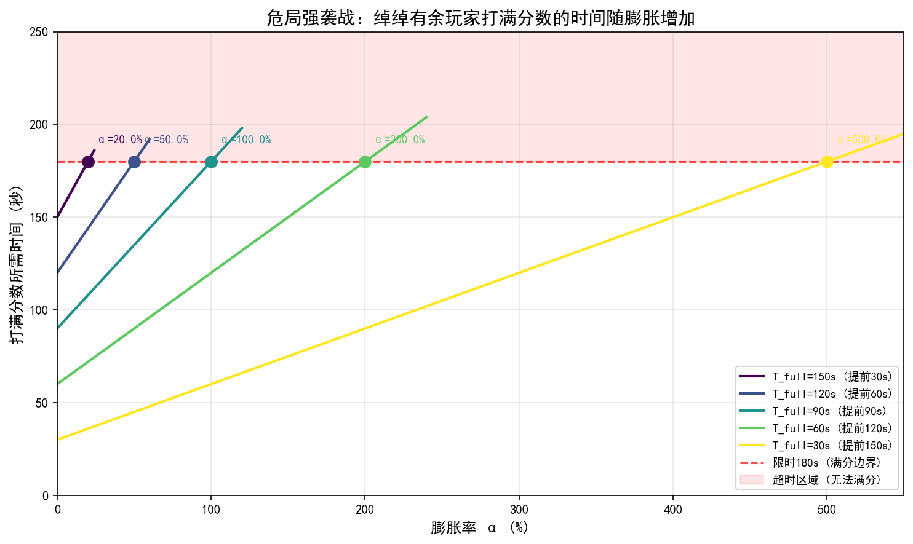

#### 2.4.2 奖励线临界（刚好20000分，即15000伤害分）

奖励线玩家不以满分时间 $T_{\text{full}}$ 衡量自身强度——他们可能从未满分，甚至不知道自己的 $T_{\text{full}}$ 是多少。奖励线玩家的天然度量是**无膨胀时的原始分数 $S_0$**（即在 $\alpha=0$ 时的得分）。对于一个原始分数为 $S_0$ 的玩家，其隐含的输出能力 $Q_0$ 可由分段线性映射反解得出，进而求得使其分数降至20000分的临界膨胀率 $\alpha_{\text{reward}}$。

通过数值求解得到：

| $S_0$（原始分数，$\alpha=0$） | 等效 $T_{\text{full}}$ | 与奖励线的"分数缓冲" | $\alpha_{\text{reward}}$ |
|:---:|:---:|:---:|:---:|
| 20000（刚好奖励线） | 820s | 0分 | **0%**（无缓冲，任何膨胀立即掉出） |
| 25000 | 640s | 5000分 | **28.1%** |
| 30000 | 528s | 10000分 | **55.3%** |
| 35000 | 443s | 15000分 | **85.0%** |
| 40000 | 381s | 20000分 | **115.1%** |
| 45000 | 314s | 25000分 | **161.2%** |
| 50000 | 264s | 30000分 | **210.9%** |
| 55000 | 228s | 35000分 | **259.2%** |
| 60000 | 201s | 40000分 | **307.5%** |
| 65000（刚好满分） | 180s | 45000分 | **355.7%** |

**核心洞察**：

1. **分数缓冲决定安全边际**：奖励线玩家的安全边际完全取决于当前分数距离20000分的"分数缓冲"。缓冲越大，可承受的膨胀越大。
2. **缓冲与膨胀的非线性关系**：从30000分到40000分（缓冲+10000分），临界膨胀从55.3%升至115.1%（增加约60个百分点）；而从50000分到60000分（同样缓冲+10000分），临界膨胀从210.9%升至307.5%（增加约97个百分点）。这是因为高分段的分数效率 $\eta$ 更高（见2.1节），同样的血量膨胀造成更少的分数损失。
3. **最低分群体极度脆弱**：$S_0 \leq 25000$ 的玩家，缓冲不足5000分，临界膨胀不到30%，在持续膨胀的环境下将很快掉出奖励线。

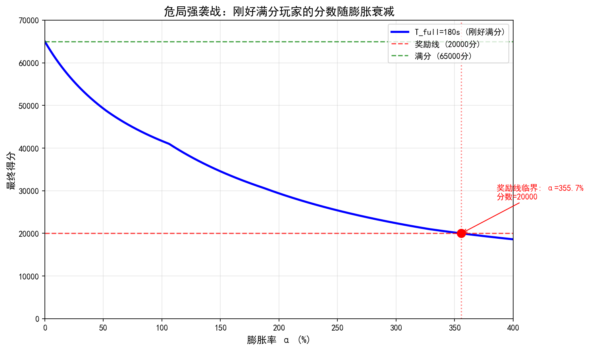

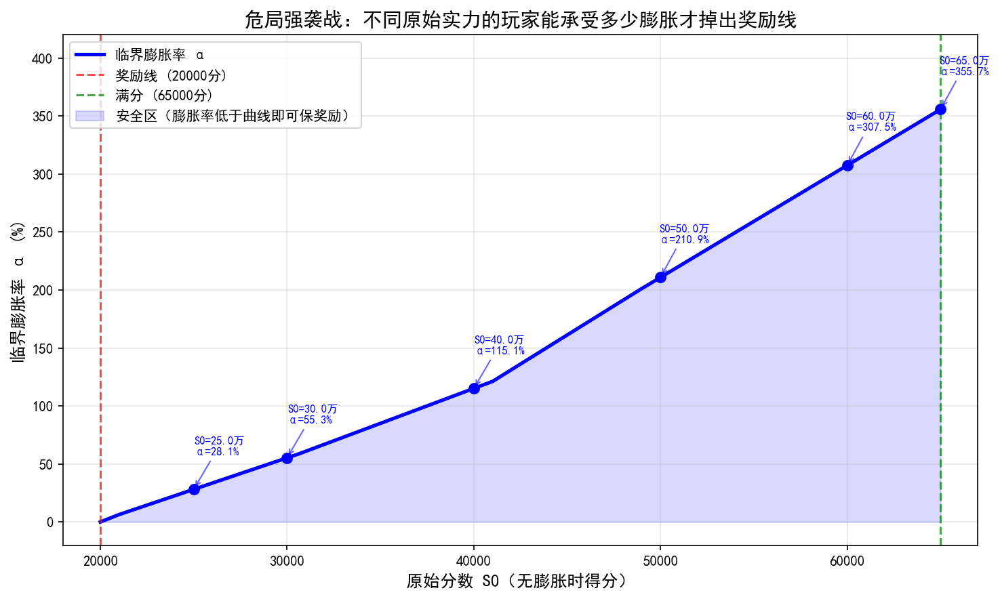

---

## 3. 式舆防卫战（Shiyu Defense）分析

### 3.1 计分机制

式舆防卫战采用**随时间衰减的倍率加权积分**模型：

- **0–60秒**：5.0×
- **61–70秒**：4.2×
- **71–80秒**：3.5×
- **81–90秒**：3.0×
- **91–105秒**：2.5×
- **106–120秒**：2.0×
- **121–135秒**：1.6×
- **136–150秒**：1.3×
- **151–300秒**：1.0×

**关键区别**：得分不是"总时间→单一分数"的映射，而是**每个时刻获得的分数乘以该时刻的倍率后累加**。

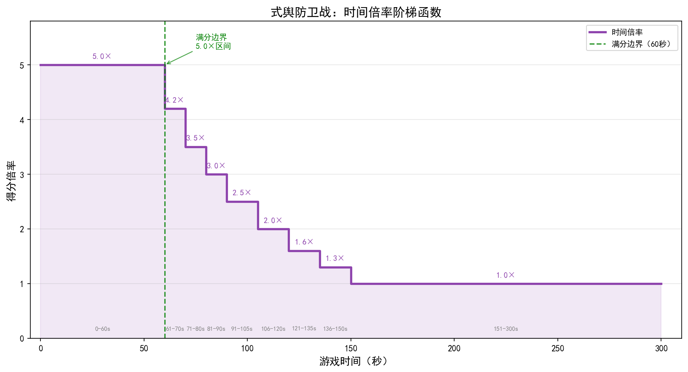

*上图展示了游戏时间（x轴）与得分倍率（y轴）的阶梯函数关系。倍率从最初60秒的5.0×逐级下降至151秒后的1.0×，共9个平台。60秒以内的战斗获得最高倍率，超出60秒后加权平均倍率持续下降。*

### 3.2 敌人组合与分数分布

- **组合A**：5普通 + 1精英 + 1首领
- **组合B**：2精英 + 1首领

血量假设：
- 普通：被秒杀（0血量），伤害分100，击败分100
- 精英：血量 $= H/n$，伤害分500，击败分500
- 首领：血量 $= H$，伤害分8000

**时间分布**（组合A/B在 $T_{\text{base}} \leq 240\text{s}$ 时等价）：
- 普通：$t = 0$（瞬时）
- 精英：均匀分布在 $[0, T_{\text{base}}/n]$
- 首领：均匀分布在 $[T_{\text{base}}/n, T_{\text{base}}]$

通过统计数据，n $\approx$ 6 (不是很严谨的统计)，但是根据实际，也根据进一步的简化，我们假设普通+精英波次的总分2000分，始终落在5.0倍率区间，因此等效固定获得10000分，因此对首领的伤害分成为主要的考虑对象

### 3.3 分数函数（积分型）

$$
\boxed{S_{\text{SD}}(\alpha) = 10000 + 8000 \cdot \bar{m}(\alpha)}
$$

其中：
- **固定部分**（普通+精英）：10000分，始终落在5.0倍率区间
- **首领部分**：8000分，按首领战斗时段的时间加权平均倍率计算

### 3.4 临界膨胀系数

#### 3.4.1 满分临界（刚好50000分）

首领时段完全落在5.0倍率区间的条件是 $T_{\text{total}}(\alpha) \leq 60\text{s}$：

$$
(1+\alpha) \cdot T_{\text{base}} = 60 \quad \Rightarrow \quad \boxed{\alpha_{\text{full}} = \frac{60}{T_{\text{base}}} - 1}
$$

| $T_{\text{base}}$ | 提前比例 | $\alpha_{\text{full}}$ |
|:---:|:---:|:---:|
| 60s | 0% | **0%**（任何膨胀立即掉分） |
| 50s | 16.7% | **20.0%** |
| 40s | 33.3% | **50.0%** |
| 30s | 50.0% | **100.0%** |
| 20s | 66.7% | **200.0%** |

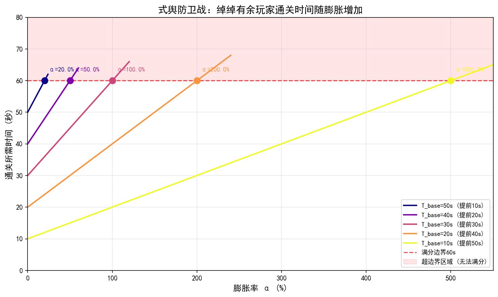

#### 3.4.2 奖励线临界（刚好25000分）

与危局同理，式舆奖励线玩家的天然度量是原始分数 $S_0$。通过数值求解（先由 $S_0$ 反解 $T_{\text{base}}$，再求使分数降至25000分的 $\alpha$），得到：

| $S_0$（原始分数，$\alpha=0$） | 等效 $T_{\text{base}}$ | 与奖励线的"分数缓冲" | $\alpha_{25\text{k}}$ |
|:---:|:---:|:---:|:---:|
| 25000（刚好奖励线） | 222s | 0分 | **0%**（无缓冲） |
| 28000 | 190s | 3000分 | **17.0%** |
| 30000 | 173s | 5000分 | **28.3%** |
| 33000 | 153s | 8000分 | **45.3%** |
| 35000 | 141s | 10000分 | **57.8%** |
| 38000 | 124s | 13000分 | **78.9%** |
| 40000 | 114s | 15000分 | **95.4%** |
| 42000 | 104s | 17000分 | **113.6%** |
| 45000 | 90s | 20000分 | **148.3%** |
| 47000 | 80s | 22000分 | **179.2%** |
| 50000（刚好满分） | 60s | 25000分 | **270.3%** |

**核心洞察**：

1. **式舆的缓冲更"线性"**：与危局的超比例缓冲不同，式舆的积分模型使临界膨胀随分数大致线性增长。30000分→40000分（+10000分缓冲），临界膨胀从28.3%升至95.4%（增加约67个百分点）；40000分→50000分（同样+10000分缓冲），临界膨胀从95.4%升至270.3%（增加约175个百分点）。高分段仍有一定加速，但不如危局剧烈。
2. **中低分群体安全边际显著低于危局**：同为原始分数35000分，危局可承受85.0%膨胀，式舆仅可承受57.8%。这是因为式舆奖励线占总分50%（25000/50000），而危局仅占30.8%（20000/65000）——式舆的奖励线门槛更高，留给玩家的缓冲空间更少。
3. **S₀ < 30000的玩家极度脆弱**：缓冲不足5000分，临界膨胀不到30%。

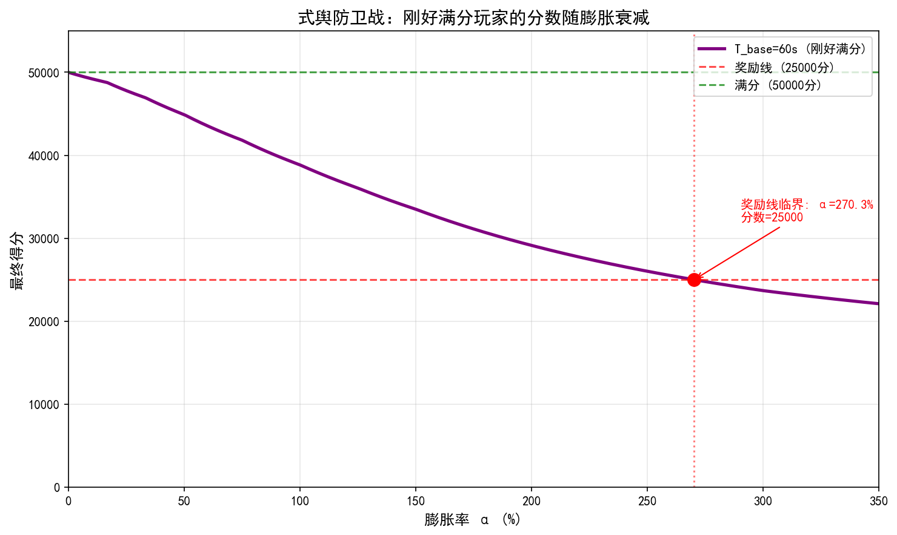

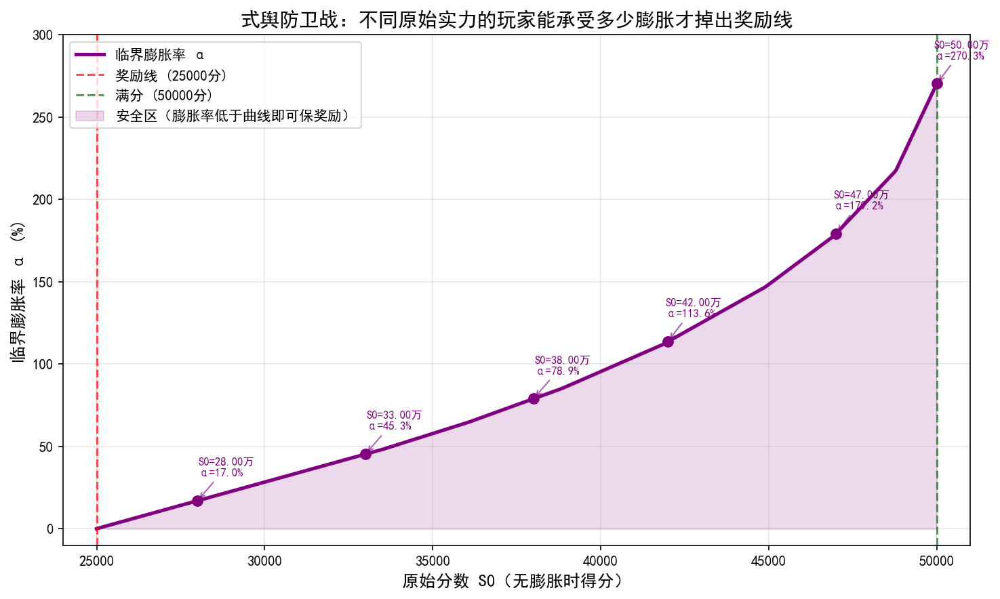

---

## 4. 两模式对比（时间参数化）

### 4.1 满分安全边际的完全对称性

两模式的满分临界公式具有**完全对称**的结构：

| 模式 | 限时/边界 | 满分临界公式 | 核心性质 |
|:---:|:---:|:---:|:---|
| **危局强袭战** | 180秒 | $\alpha_{\text{full}} = 180/T_{\text{full}} - 1$ | 提前 $x\%$ → 承受 $x\%$ 膨胀 |
| **式舆防卫战** | 60秒 | $\alpha_{\text{full}} = 60/T_{\text{base}} - 1$ | 提前 $x\%$ → 承受 $x\%$ 膨胀 |

**直观理解**：
- 危局：你比180秒限时快了多少，就能承受多少膨胀
- 式舆：你比60秒满分边界快了多少，就能承受多少膨胀

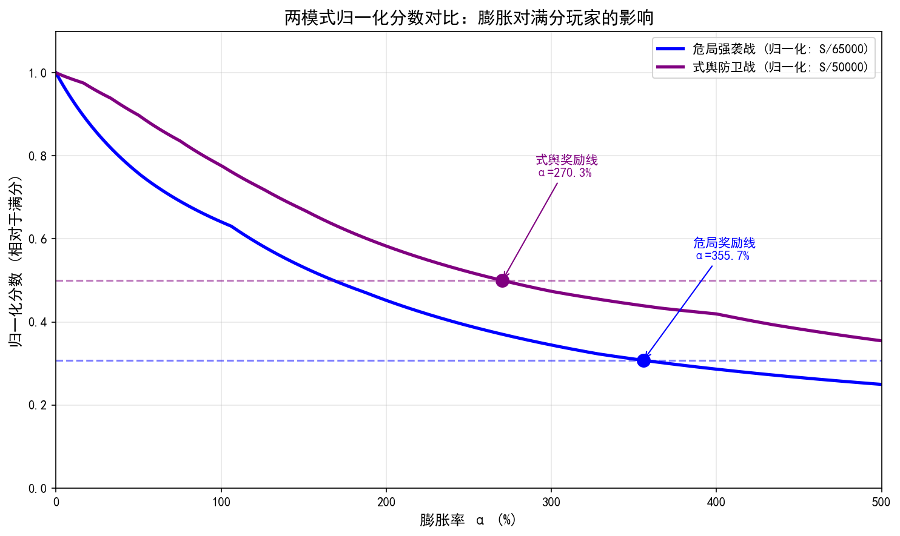

### 4.2 奖励线安全边际对比

以原始分数 $S_0$ 为统一度量，对比两模式在相同"分数缓冲"下的膨胀承受能力：

| 分数缓冲（$S_0 - S_{\text{reward}}$） | 危局 $S_0$ | 危局临界 $\alpha$ | 式舆 $S_0$ | 式舆临界 $\alpha$ | 危局/式舆比 |
|:---:|:---:|:---:|:---:|:---:|:---:|
| 5000分 | 25000 | 28.1% | 30000 | 28.3% | 0.99× |
| 10000分 | 30000 | 55.3% | 35000 | 57.8% | 0.96× |
| 15000分 | 35000 | 85.0% | 40000 | 95.4% | 0.89× |
| 20000分 | 40000 | 115.1% | 45000 | 148.3% | 0.78× |
| 25000分（式舆满分） | 45000 | 161.2% | 50000 | 270.3% | 0.60× |
| 30000分 | 50000 | 210.9% | — | — | — |
| 45000分（危局满分） | 65000 | 355.7% | — | — | — |

**核心差异**：
- 在相同的绝对分数缓冲下（≤15000分），两模式的临界膨胀接近，危局甚至略低于式舆——因为危局20000分门槛虽低，但低分段的分数效率 $\eta$ 也低（520分/血量）。
- 缓冲越大，危局的**超比例优势**越明显：缓冲25000分时，式舆临界270.3% > 危局临界161.2%——但注意此时的式舆 $S_0=50000$ 已是满分（满分玩家当然有更大缓冲）。
- **公平对比**应在归一化框架下进行——见下方图8。

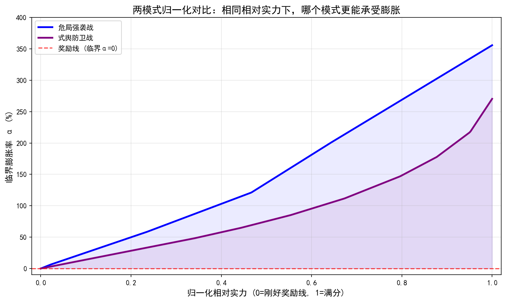

### 4.3 分数形态对比

| 维度 | 危局强袭战 | 式舆防卫战 |
|:---|:---|:---|
| **分数形态** | 连续分段线性 | 平滑递减+阶梯拐点 |
| **膨胀影响** | 平滑递减 | 首领时段加权平均倍率下降 |
| **满分条件** | $T_{\text{full}} \leq 180\text{s}$ | $T_{\text{base}} \leq 60\text{s}$ |
| **满分安全边际** | 提前 $x\%$ → 承受 $x\%$ 膨胀 | 提前 $x\%$ → 承受 $x\%$ 膨胀 |
| **掉分方式** | Gradual loss（逐渐损失） | 首领时段跨越倍率边界时加速 |
| **奖励线** | 20000分（连续过渡） | 25000分（积分缓冲） |

---

## 5. 核心结论与实战含义

### 5.1 满分玩家的脆弱性（时间视角）

两种模式的满分玩家都遵循相同的脆弱性规律：

- **刚好满分**（危局 $T_{\text{full}}=180\text{s}$，式舆 $T_{\text{base}}=60\text{s}$）：任何膨胀立即掉分
- **提前50%**（危局 $T_{\text{full}}=90\text{s}$，式舆 $T_{\text{base}}=30\text{s}$）：可承受100%膨胀
- **提前83%**（危局 $T_{\text{full}}=30\text{s}$，式舆 $T_{\text{base}}=10\text{s}$）：可承受500%膨胀

> **关键修正**：$T_{\text{full}}=30\text{s}$ 和 $T_{\text{full}}=180\text{s}$ 的玩家虽然 $\alpha=0$ 时都是65000分，但前者的DPS是后者的6倍，因此可承受500%膨胀（血量变为6倍，打满时间变为180s，刚好触及限时边界），而后者可承受0%膨胀。

### 5.2 奖励线玩家的安全边际

- **危局**：原始分数 $S_0=65000$（刚好满分）的玩家可承受355.7%膨胀才掉出20000分。这是因为20000分仅要求15000伤害分，对应约21.94%总血量，限时180秒内即使DPS不变，膨胀4.5倍后仍可在时间内达到。分数越低的玩家缓冲越小：$S_0=25000$（缓冲仅5000分）仅能承受28.1%膨胀。
- **式舆**：原始分数 $S_0=50000$（刚好满分）的玩家可承受270.3%膨胀才掉出25000分。$S_0=35000$（缓冲10000分）的玩家可承受57.8%膨胀。式舆的奖励线门槛占总分比例更高（50% vs 危局的30.8%），因此中低分玩家的缓冲相对更薄。

### 5.3 最脆弱的玩家群体

- **危局**：$S_0=20000$（刚好奖励线），任何膨胀立即掉出；$S_0=25000$（缓冲5000分），仅能承受28.1%膨胀
- **式舆**：$S_0=25000$（刚好奖励线），任何膨胀立即掉出；$S_0=30000$（缓冲5000分），仅能承受28.3%膨胀
- **式舆**：$S_0=28000$（缓冲3000分），仅17.0%膨胀就掉出25000分

### 5.4 设计启示

从时间参数化视角，两模式的满分安全边际完全对称，但奖励线安全边际差异显著：
- 危局的分段线性映射为低分目标提供了**超比例缓冲**
- 式舆的积分模型为低分目标提供了**线性缓冲**
- 式舆的阶梯倍率实际上为**中低强度玩家提供了更强的"膨胀免疫"**

---

## 6. 实证预测：基于线性膨胀模型的分数衰减预测

### 6.1 分析框架与使用指南

本文**第2节**与**第3节**分别建立了危局强袭战与式舆防卫战的分数理论模型，以下通过线性回归验证两种挑战模式中怪物血量的实际膨胀规律。**本章的核心目的**：利用已验证的线性膨胀模型，帮助玩家**预测**自己未来的分数变化。

> **如何使用本章**：找到与你当前情况最接近的行（通关时间或当前分数），即可查询你的**满分剩余期数**（Type A）或**奖励线剩余期数**（Type B）。

具体而言，本章回答以下预测问题：

> **给定各模式的实际血量膨胀速率，不同类型的玩家在未来将拿到多少分？何时掉出满分？何时掉出奖励线？**

以下预测基于一个核心假设：怪物血量膨胀的线性趋势将持续。下文6.1.3节的回归分析为这一假设提供了坚实的统计基础——危局排除异常后 $R^2$ 均值 0.9396，式舆个体中位数 $R^2 = 0.9811$。

#### 6.1.1 两类玩家定义

本节的分析聚焦于两类具有代表性的玩家群体：

| 玩家类型 | 当前状态 | 评判标准 | 核心关切 |
|:---|:---|:---|:---|
| **A类：竞速/满分玩家** | 通关时长 $T < T_{\max}$，能拿满分，拥有时间冗余 | **当前版本的通关时间** $T$ | 膨胀后 $(1+\alpha)T$ 何时超过 $T_{\max}$，即何时掉出满分线 |
| **B类：奖励线玩家** | 不能满分（$T \geq T_{\max}$），但分数高于奖励线 $S_{\text{reward}}$，时间冗余已耗尽 | **当前版本的分数** $S$ | 膨胀后 $S$ 何时跌破 $S_{\text{reward}}$ |

**关键区别**：

- **A类玩家**的冗余在**时间维度**：虽然都是满分（$S = S_{\max}$），但通关时间 $T$ 不同，$T$ 越小安全边际越大。**参数化方式**：用 $T_{\text{full}}$（危局）或 $T_{\text{base}}$（式舆）标记其强度。
- **B类玩家**的时间冗余已耗尽，冗余在**分数维度**：当前分数 $S$ 距离奖励线的差值是安全边际。**参数化方式**：用**当前版本的分数** $S$ 标记其强度。例如"当前第41期得分55000分的玩家"——这个 $S$ 隐含了玩家的DPS水平（由 $S$ 和当前 $\alpha$ 反解得出）。

#### 6.1.2 数据来源与处理方法

两种模式采用附录中的**各自独立数据**进行分析：

| 维度 | 危局强袭战 | 式舆防卫战 |
|:---|:---|:---|
| **数据来源** | 附录A：第1\~41期，每期3只怪物 | 附录B：节点62038\~62050（13节点），每节点2\~3只BOSS |
| **回归方法** | 各期3只怪物血量取算术平均，对期数 $n$ 一元线性回归 | 各节点BOSS血量取算术平均，对节点序号一元线性回归 |
| **HP趋势函数** | $\text{HP}_{\text{HZ}}(n) = 3.944n + 47.233$（百万，$R^2=0.8293$） | $\text{HP}_{\text{SD}}(n) = 1.089n + 24.550$（百万，$R^2=0.6354$） |
| **等效膨胀系数** | $\alpha(n) = \frac{\text{HP}(n)}{\text{HP}(1)} - 1$ | $\alpha(n) = \frac{\text{HP}(n)}{\text{HP}(1)} - 1$ |
| **分数函数** | $S_{\text{HZ}}(\alpha)$（第2节，分段线性模型） | $S_{\text{SD}}(\alpha)$（第3节，时间加权积分模型） |
| **个体回归验证** | 排除异常点后13种怪物全部 $R^2 \geq 0.85$，均值 $0.9396$（见6.1.3节） | 8种BOSS中5种 $R^2 \geq 0.95$，中位数 $0.9811$（见6.1.3节） |

> **注**：各期/节点平均血量的 $R^2$ 受怪物轮换影响而偏低，但按怪物个体的回归证实了膨胀趋势具有高度统计显著性（危局排除2个异常点后100%个体 $R^2 \geq 0.85$，式舆62.5%个体 $R^2 \geq 0.95$）。详见下文6.1.3节回归统计汇总。

#### 6.1.3 回归统计汇总

以下汇总了两种模式中个体怪物/首领的线性回归统计结果，为第6.2\~6.4节的线性膨胀预测提供统计基础。完整个体数据见附录C.1和C.3。

**危局强袭战：个体怪物线性拟合汇总**

| 统计指标 | 全部15种 | 排除异常点（13种） |
|----|:---|:---|
| 参与回归的怪物数 | 15 种 | **13 种** |
| R² ≥ 0.95（极佳，Highly Linear） | 7 种（46.7%） | 7 种（53.8%） |
| 0.85 ≤ R² < 0.95（良好） | 5 种（33.3%） | **6 种（46.2%）** |
| 0.70 ≤ R² < 0.85（一般） | 1 种（6.7%） | 0 种（0%） |
| R² < 0.70（较差） | 1 种（6.7%） | 0 种（0%） |
| R² 均值 | 0.8940 | **0.9396** |
| R² 中位数 | 0.9334 | **0.9507** |
| 平均膨胀速率（斜率均值） | 4.370 百万 HP/期 | 4.583 百万 HP/期 |
| 膨胀速率中位数 | 3.586 百万 HP/期 | 3.586 百万 HP/期 |
| 最高个体膨胀速率 | 叛律孤歌·薇斯珀（13.394 百万/期） | 同左 |
| 拟合最佳怪物 | 叛律孤歌·薇斯珀（R²=0.9932） | 同左 |
| 所有怪物 R² ≥ 0.85 | 否（12/15） | **是（13/13，100%）** |

> **注**：排除的两个异常点为 **死路屠夫**（R²=0.1554，仅3次出场，膨胀线性度极差）和 **「霸主侵蚀体·庞培」**（R²=0.8034，5次出场，属于一般线性）。排除后，剩余13种怪物的R²全部≥0.85，均值从0.8940提升至0.9396，说明危局强袭战的怪物血量膨胀具有**高度稳定的线性特征**。对应的R² vs 增长率散点图见 `charts/weiju/chart_r2_vs_growth_filtered.png`。

**式舆防卫战：个体BOSS线性拟合汇总**

| 统计指标 | 数值 |
|:---|:---|
| 参与回归的BOSS数 | 8 种 |
| R² ≥ 0.95（极佳，Highly Linear） | 5 种（62.5%） |
| 0.70 ≤ R² < 0.85（一般，Moderate） | 2 种（25.0%） |
| R² < 0.70（较差） | 1 种（12.5%） |
| R² 均值 | 0.8610 |
| R² 中位数 | 0.9811 |
| 平均膨胀速率（斜率均值） | 134.99 万/节点 |
| 最高膨胀速率 | 秽蚀·蛮横力士（355.2 万/节点） |
| 拟合最佳BOSS | 秽蚀·蛮横力士（R²=0.9980） |

**两模式回归对比**

| 对比维度 | 危局强袭战 | 式舆防卫战 |
|:---|:---|:---|
| 时间跨度 | 41期（约19个月） | 13节点（约7个月） |
| 怪物种类 | 18种 | 14种 |
| 不可回归/异常怪物 | 2种（R²<0.85） | 3种（出场<3次） |
| R² 均值 | 0.8940（全部）/ **0.9396（排除异常）** | 0.8610 |
| 高线性（R²≥0.95）占比 | 46.7%（全部）/ **53.8%（排除异常）** | 62.5% |
| 排除异常后全量R²≥0.85 | **是（13/13，100%）** | — |
| 每期/节点HP增幅 | \~3.59 百万/期（中位数） | \~107.3 万/节点（中位数） |
| 相对增幅/期 | \~2.8% | \~2.0\~6.0%（因BOSS而异） |

**关键发现**：

1. **危局强袭战膨胀趋势明确且高度线性**：排除2个异常点（死路屠夫R²=0.16、「霸主侵蚀体·庞培」R²=0.80）后，剩余13种怪物的R²**全部≥0.85**，均值达0.9396。叛律孤歌·薇斯珀（R²=0.9932）和「亵渎者」（R²=0.9897）的线性增长最为显著。这说明危局强袭战的怪物血量膨胀具有**极其稳定的线性特征**。

2. **式舆防卫战同样存在膨胀**：8种可回归BOSS中，5种R²≥0.95，线性趋势明显。尤其是秽蚀·蛮横力士，R²高达0.9980，且斜率（355.2万/节点）远超其他BOSS，提示该BOSS可能存在特殊的数值上调策略。

3. **新登场怪物起始血量更高**：对比早期怪物（如「霸主侵蚀体·庞培」首秀58.4百万）与后期怪物（如太初梦魇·「始主」首秀216.7百万），新怪物的起始血量显著提升，反映了跨版本的"阶梯式"膨胀特征。

4. **式舆防卫战BOSS血量波动较大**：部分BOSS（如秽蚀·狛野真斗R²=0.5425）的R²较低，说明式舆防卫战中同一BOSS在不同节点的血量波动较大，可能存在非线性的数值调整策略（如特定节点的难度调整），膨胀模式不如危局强袭战稳定。

5. **两模式膨胀速率可比**：若将式舆的13个节点对应到约7个月的时间跨度，月均2个节点，则平均每节点增幅约107万HP，折合每月约214万HP。危局强袭战每期（约2周）约359万HP，折合每月约718万HP。危局强袭战的绝对膨胀速率约为式舆防卫战的3.4倍，这与危局强袭战作为高难挑战模式、怪物血量基数更大的定位一致。

#### 6.1.4 数据局限性

1. **式舆防卫战节点数较少**（13个），且节点之间的时间间隔不完全均等，基于节点序号的线性回归结果仅供参考相对趋势。
2. **出场次数少的怪物**（如猎血清道夫、异变能量体、基塔布鲁等仅出场2次）无法进行可靠的趋势分析，需要更多数据积累。
3. **式舆防卫战未提供日期映射**，两模式之间的时间对齐为近似估计，精确的交叉对比需获取节点与日期的官方映射关系。
4. 两模式的计分规则不同（危局为累计伤害分段计分，式舆为通关时间效率计分），HP膨胀对玩家分数的影响机制需要分别建模分析，详见本文第2节与第3节。

---

### 6.2 危局强袭战预测分析

#### 6.2.1 数据基础：平均血量演化与等效膨胀系数

对第1\~41期各期3只怪物的平均血量进行线性回归：

$$
\boxed{\text{HP}_{\text{HZ}}(n) = 3.944 \cdot n + 47.233 \quad (R^2 = 0.8293)}
$$

各期等效膨胀系数 $\alpha_{\text{HZ}}(n) = \frac{3.944n + 47.233}{51.177} - 1$：

| 期数 | 等效 $\alpha$ | 血量倍数 | 拟合平均血量（百万） |
|:---:|:---:|:---:|:---:|
| 第1期 | 0.00% | 1.00× | 51.2 |
| 第5期 | 30.82% | 1.31× | 67.0 |
| 第10期 | 69.35% | 1.69× | 86.7 |
| 第15期 | 107.88% | 2.08× | 106.4 |
| 第20期 | 146.41% | 2.46× | 126.1 |
| 第25期 | 184.94% | 2.85× | 145.8 |
| 第30期 | 223.47% | 3.23× | 165.5 |
| 第35期 | 262.00% | 3.62× | 185.3 |
| 第40期 | 300.52% | 4.01× | 205.0 |
| **第41期（当前）** | **308.23%** | **4.08×** | **208.9** |
| 第45期（预测） | 339.05% | 4.39× | 224.7 |
| 第50期（预测） | 377.58% | 4.78× | 244.4 |

> **关键数据**：截至第41期，怪物拟合平均血量已膨胀至初始的 **4.08倍**（等效 $\alpha = 308.23\%$）。6.1.3节进一步确认：排除2个线性异常点后，13种怪物的个体 $R^2$ 全部 $\geq 0.85$（均值 $0.9396$），膨胀具有高度稳定的线性特征。

#### 6.2.2 预测总览：不同强度玩家的分数衰减轨迹

下表展示了8档典型强度（以 $T_{\text{full}}$ 标记）的玩家分数随期数变化的**预测值**，作为后续分类分析的背景参考：

| $T_{\text{full}}$ | 第1期 | 第10期 | 第20期 | 第30期 | 第41期（当前） | 第45期 | 第50期 |
|:---:|:---:|:---:|:---:|:---:|:---:|:---:|:---:|
| 30s | 65000 ★ | 65000 ★ | 65000 ★ | 65000 ★ | 65000 ★ | 65000 ★ | 65000 ★ |
| 45s | 65000 ★ | 65000 ★ | 65000 ★ | 65000 ★ | 64045 ○ | 60798 ○ | 57330 ○ |
| 60s | 65000 ★ | 65000 ★ | 65000 ★ | 61573 ○ | 52485 ○ | 50050 ○ | 47498 ○ |
| 75s | 65000 ★ | 65000 ★ | 63769 ○ | 52819 ○ | 45669 ○ | 43793 ○ | 41789 ○ |
| 90s | 65000 ★ | 65000 ★ | 56109 ○ | 47050 ○ | 41216 ○ | 38755 ○ | 35972 ○ |
| 120s | 65000 ★ | 59605 ○ | 46616 ○ | 39376 ○ | 32083 ○ | 30079 ○ | 27767 ○ |
| 150s | 65000 ★ | 51245 ○ | 41084 ○ | 32352 ○ | 26078 ○ | 24346 ○ | 22496 ○ |
| 180s | 65000 ★ | 45787 ○ | 34992 ○ | 27353 ○ | 21967 ○ | 20595 ○ | **19281** |

★ = 满分（≥65000），○ = 奖励线以上（≥20000），**粗体** = 掉出奖励线（<20000）

> **读表提示**：每行对应一个强度等级的分数预测轨迹。从左到右，分数随膨胀递减。注意不同行的"掉满分期"和"掉奖励线期"差异巨大。

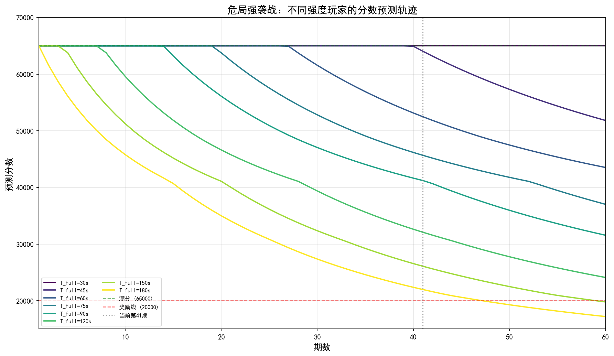

---

#### 6.2.3 A类玩家（竞速/满分）：通关时间视角

A类玩家在无膨胀时打满60000伤害分所需时间为 $T_{\text{full}}$ 秒（$T_{\text{full}} < 180$）。膨胀后打满时间变为 $(1+\alpha) \cdot T_{\text{full}}$。当 $(1+\alpha) \cdot T_{\text{full}} > 180$ 时，限时内无法打满，分数开始下降。

**评判标准**：当前版本（第41期，$\alpha = 308.23\%$）的通关时间 $(1+\alpha) \cdot T_{\text{full}}$ 是否超过180秒限时。

##### 满分掉分期预测（细粒度）

| $T_{\text{full}}$ | 当前通关时间 | 当前状态 | 满分掉分期 | 距当前剩余 |
|:---:|:---:|:---:|:---:|:---:|
| 15s | 61s | 满分 ★ | 第144期 | 103期 |
| 30s | 122s | 满分 ★ | 第66期 | 25期 |
| 45s | 184s | 已掉出 ✗ | 第40期 | −1期（刚掉） |
| 60s | 245s | 已掉出 ✗ | 第27期 | −14期 |
| 75s | 306s | 已掉出 ✗ | 第20期 | −21期 |
| 90s | 367s | 已掉出 ✗ | 第14期 | −27期 |
| 105s | 429s | 已掉出 ✗ | 第11期 | −30期 |
| 120s | 490s | 已掉出 ✗ | 第8期 | −33期 |
| 135s | 551s | 已掉出 ✗ | 第6期 | −35期 |
| 150s | 612s | 已掉出 ✗ | 第4期 | −37期 |
| 165s | 674s | 已掉出 ✗ | 第3期 | −38期 |
| 180s | 735s | 已掉出 ✗ | 第2期 | −39期 |

**核心发现**：

- **$T_{\text{full}} = 15$s**（顶级竞速）：当前通关仅需61秒，满分安全边际103期。这是仅有的"高枕无忧"群体。
- **$T_{\text{full}} = 30$s**（极强）：当前122秒通关，剩余25期满分安全边际。到第66期（约12.5个月后）将掉出满分。
- **$T_{\text{full}} = 45$s**（很强）：第40期刚掉出满分（当前通关184秒，超限4秒），属于"满分边缘群体"。
- **$T_{\text{full}} \geq 60$s**：早已掉出满分线，通关时间远超180秒。他们构成了下文B类玩家的主体。

---

#### 6.2.4 B类玩家（奖励线）：按当前分数查询预测

B类玩家在当前版本（第41期，$\alpha = 308.23\%$）已不能满分，但分数仍高于20000分奖励线。**使用方式**：在下面表格中找到与你当前分数最接近的行，即可看到你的**预测奖励线掉分期**和**剩余期数**。对每个当前分数 $S$，通过反解得出其等效 $T_{\text{full}}$（即该玩家的隐含DPS水平），进而预测未来分数轨迹。

##### 奖励线掉分期预测（按当前分数分档，每5000分一档）

| 当前分数 $S$（第41期） | 等效 $T_{\text{full}}$ | 奖励线掉分期 | 距当前剩余 | 玩家画像 |
|:---:|:---:|:---:|:---:|:---|
| 60000 | 49s | 第204期 | 163期 | 接近满分，极其安全 |
| 55000 | 56s | 第179期 | 138期 | 强奖励线玩家，安全边际充裕 |
| 50000 | 65s | 第153期 | 112期 | 中等偏强，远期无忧 |
| 45000 | 77s | 第127期 | 86期 | 中等玩家，约43个月安全 |
| 40000 | 93s | 第102期 | 61期 | 中等偏弱，约30个月安全 |
| 35000 | 109s | 第87期 | 46期 | 较弱玩家，约23个月安全 |
| 30000 | 129s | 第71期 | 30期 | 弱玩家，约15个月后风险 |
| 25000 | 157s | 第56期 | 15期 | 接近奖励线，约7.5个月后风险 |
| 22000 | 180s | 第48期 | **7期** | 奖励线边缘，约3.5个月后掉出！ |

**核心发现**：

- **当前得分 ≥ 50000分的玩家**：奖励线安全边际超过112期（约4.5年以上），完全无需担忧。
- **当前得分 35000\~45000分的玩家**：剩余46\~86期（约2\~3.5年），中长期安全。
- **当前得分 22000分的玩家**：仅剩**7期**（约3.5个月）就会掉出奖励线。这是最紧迫的群体——虽然在第2期就已失去满分，但凭借分段线性映射的超比例缓冲效应撑到了现在，而缓冲即将耗尽。
- **规律**：当前分数每下降5000分，奖励线剩余期数减少约15\~25期。分数越低的玩家，安全边际衰减越快。

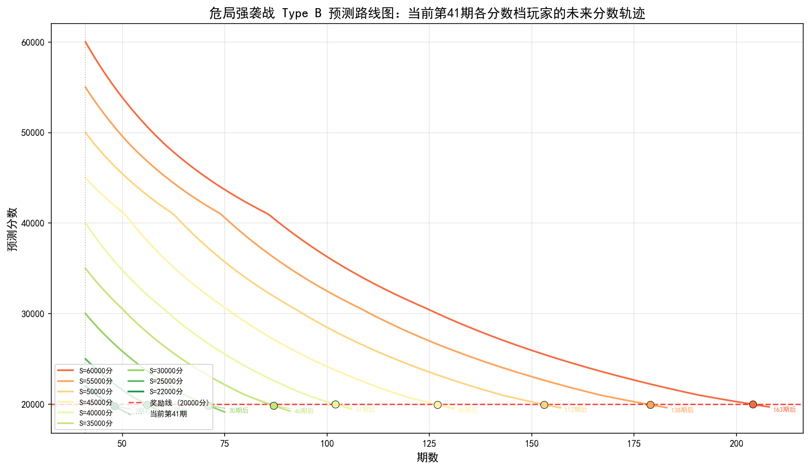

### 6.3 式舆防卫战预测分析

#### 6.3.1 数据基础：平均血量演化与等效膨胀系数

对节点62038\~62050（记为节点1\~13）各节点BOSS的平均血量进行线性回归：

$$
\boxed{\text{HP}_{\text{SD}}(n) = 1.089 \cdot n + 24.550 \quad (R^2 = 0.6354)}
$$

各节点等效膨胀系数 $\alpha_{\text{SD}}(n) = \frac{1.089n + 24.550}{25.639} - 1$：

| 节点 | 等效 $\alpha$ | 血量倍数 | 拟合平均血量（百万） |
|:---:|:---:|:---:|:---:|
| 节点1（62038） | 0.00% | 1.00× | 25.6 |
| 节点3 | 8.50% | 1.08× | 27.8 |
| 节点5 | 16.99% | 1.17× | 30.0 |
| 节点7 | 25.49% | 1.25× | 32.2 |
| 节点9 | 33.99% | 1.34× | 34.4 |
| 节点11 | 42.48% | 1.42× | 36.5 |
| **节点13（当前）** | **50.98%** | **1.51×** | **38.7** |
| 节点15（预测） | 59.47% | 1.59× | 40.9 |
| 节点20（预测） | 80.71% | 1.81× | 46.3 |

> **关键数据**：截至节点13，BOSS拟合平均血量已膨胀至初始的 **1.51倍**（等效 $\alpha = 50.98\%$）。式舆的 $R^2 = 0.6354$ 受节点数少和BOSS轮换影响，但6.1.3节按个体回归的中位数 $R^2 = 0.9811$，证实了膨胀的高度线性。每节点增长率约4.25%，而危局约7.71%/期，两模式长期膨胀强度可比。

#### 6.3.2 预测总览：不同强度玩家的分数衰减轨迹

下表展示9档典型强度（以 $T_{\text{base}}$ 标记）的玩家分数随节点变化的**预测值**：

| $T_{\text{base}}$ | 节点1 | 节点5 | 节点9 | 节点13（当前） | 节点15 | 节点20 | 节点25 | 节点30 |
|:---:|:---:|:---:|:---:|:---:|:---:|:---:|:---:|:---:|
| 20s | 50000 ★ | 50000 ★ | 50000 ★ | 50000 ★ | 50000 ★ | 50000 ★ | 50000 ★ | 50000 ★ |
| 30s | 50000 ★ | 50000 ★ | 50000 ★ | 50000 ★ | 50000 ★ | 50000 ★ | 49917 ○ | 49113 ○ |
| 40s | 50000 ★ | 50000 ★ | 50000 ★ | 49945 ○ | 49494 ○ | 48315 ○ | 46758 ○ | 45036 ○ |
| 50s | 50000 ★ | 50000 ★ | 49110 ○ | 47707 ○ | 46977 ○ | 44820 ○ | 42560 ○ | 40416 ○ |
| 60s | 50000 ★ | 48740 ○ | 46845 ○ | 44765 ○ | 43624 ○ | 41071 ○ | 38603 ○ | 36237 ○ |
| 70s | 48781 ○ | 46511 ○ | 44033 ○ | 41669 ○ | 40408 ○ | 37556 ○ | 34907 ○ | 32460 ○ |
| 80s | 46933 ○ | 44076 ○ | 41337 ○ | 38683 ○ | 37354 ○ | 34366 ○ | 31631 ○ | 29319 ○ |
| 100s | 42747 ○ | 39381 ○ | 36224 ○ | 33334 ○ | 31949 ○ | 29056 ○ | 26772 ○ | **24922** |
| 120s | 38844 ○ | 35075 ○ | 31748 ○ | 29001 ○ | 27846 ○ | 25436 ○ | **23552** | **22212** |

★ = 满分（≥50000），○ = 奖励线以上（≥25000），**粗体** = 掉出奖励线（<25000）

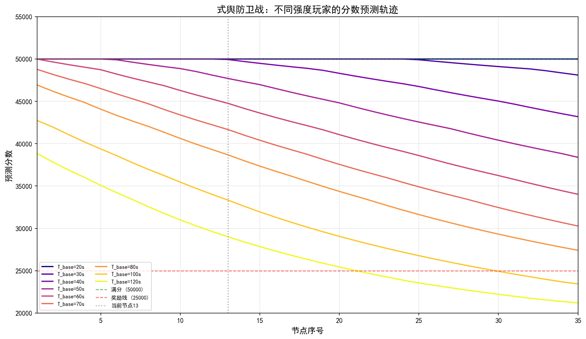

---

#### 6.3.3 A类玩家（竞速/满分）：通关时间视角

A类玩家无膨胀时通关时间为 $T_{\text{base}}$ 秒（$T_{\text{base}} < 60$）。膨胀后变为 $(1+\alpha) \cdot T_{\text{base}}$，超过60秒即掉出满分。

**评判标准**：当前版本（节点13，$\alpha = 50.98\%$）的通关时间是否超过60秒满分边界。

##### 满分掉分节点预测（细粒度）

| $T_{\text{base}}$ | 当前通关时间 | 当前状态 | 满分掉分节点 | 距当前剩余 |
|:---:|:---:|:---:|:---:|:---:|
| 5s | 8s | 满分 ★ | 永不 | — |
| 10s | 15s | 满分 ★ | 永不 | — |
| 15s | 23s | 满分 ★ | 节点72 | 59节点 |
| 20s | 30s | 满分 ★ | 节点49 | 36节点 |
| 25s | 38s | 满分 ★ | 节点34 | 21节点 |
| 30s | 45s | 满分 ★ | 节点25 | 12节点 |
| 35s | 53s | 满分 ★ | 节点18 | 5节点 |
| 40s | 60s | 已掉出 ✗ | 节点13 | 0节点（当前边界） |
| 45s | 68s | 已掉出 ✗ | 节点9 | −4节点 |
| 50s | 75s | 已掉出 ✗ | 节点6 | −7节点 |
| 55s | 83s | 已掉出 ✗ | 节点4 | −9节点 |
| 60s | 91s | 已掉出 ✗ | 节点2 | −11节点 |

**核心发现**：

- **$T_{\text{base}} \leq 10$s**（顶级竞速）：永远不担心满分问题。这是仅有的"满分无忧"群体。
- **$T_{\text{base}} = 20$s**（极强）：当前通关30秒，剩余36节点满分安全边际。
- **$T_{\text{base}} = 30$s**（很强）：剩余12节点。已在节点10掉出满分——比危局中对应强度的玩家（$T_{\text{full}}=60$s，第27期掉出）更早失去满分。
- **$T_{\text{base}} = 40$s**（较强）：恰好在当前节点（节点13）处于边界（通关时间刚好60秒），下一节点将掉出。
- **$T_{\text{base}} \geq 45$s**：早已掉出满分线，构成B类玩家主体。

##### 与危局满分安全边际的理论对比

| 对应强度 | 危局满分临界 $\alpha$ | 式舆满分临界 $\alpha$ | 危局/式舆比 |
|:---|:---:|:---:|:---:|
| $T_{\text{full}}=30$s vs $T_{\text{base}}=20$s（顶级） | 500.0% | 200.0% | **2.5×** |
| $T_{\text{full}}=45$s vs $T_{\text{base}}=30$s（强） | 300.0% | 100.0% | **3.0×** |
| $T_{\text{full}}=60$s vs $T_{\text{base}}=40$s（中） | 200.0% | 50.0% | **4.0×** |
| $T_{\text{full}}=90$s vs $T_{\text{base}}=50$s（弱） | 100.0% | 20.0% | **5.0×** |
| $T_{\text{full}}=180$s vs $T_{\text{base}}=60$s（刚好满分） | 0% | 0% | 等价 |

> 式舆的满分安全边际仅为危局的 **1/2.5 到 1/5**。60秒满分边界的狭窄性使得除顶级竞速者外的所有玩家都无法在膨胀中维持满分。

---

#### 6.3.4 B类玩家（奖励线）：按当前分数查询预测

B类玩家在当前节点（节点13，$\alpha = 50.98\%$）已不能满分，但分数仍高于25000分奖励线。**使用方式**：在下面表格中找到与你当前分数最接近的行，即可看到你的**预测奖励线掉分节点**和**剩余节点数**。

##### 奖励线掉分节点预测（按当前分数分档，每5000分一档）

| 当前分数 $S$（节点13） | 等效 $T_{\text{base}}$ | 奖励线掉分节点 | 距当前剩余 | 玩家画像 |
|:---:|:---:|:---:|:---:|:---|
| 49000 | 45s | 节点94 | 81节点 | 接近满分，极其安全 |
| 47000 | 53s | 节点77 | 64节点 | 强奖励线玩家，安全充裕 |
| 45000 | 59s | 节点66 | 53节点 | 中等偏强，长期无忧 |
| 42000 | 69s | 节点54 | 41节点 | 中等玩家，远期安全 |
| 39000 | 79s | 节点44 | 31节点 | 中等偏弱，约14个月安全 |
| 36000 | 90s | 节点36 | 23节点 | 较弱玩家，约10个月后风险 |
| 33000 | 101s | 节点30 | 17节点 | 弱玩家，约8个月后风险 |
| 30000 | 115s | 节点24 | 11节点 | 接近奖励线，约5个月后风险 |
| 27000 | 132s | 节点18 | **5节点** | 奖励线边缘，约2.5个月后掉出！ |

**核心发现**：

- **当前得分 ≥ 45000分的玩家**：安全边际超过53节点，完全无忧。
- **当前得分 27000分的玩家**：仅剩**5节点**（约2.5个月）。这是式舆中最紧迫的群体。
- **与危局的差异**：式舆奖励线（25000）占总分50%，危局仅30.8%。式舆B类玩家的缓冲相对更薄——同等"接近奖励线"的玩家，式舆给的剩余时间更短。

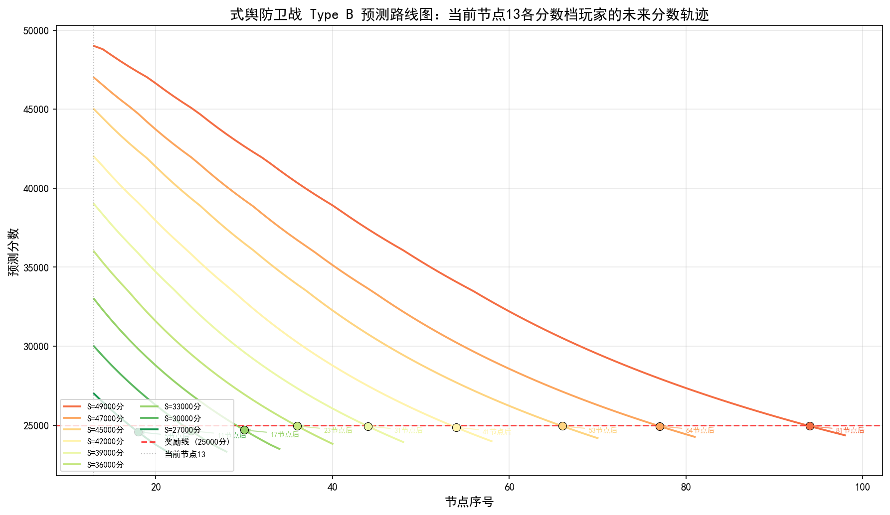

---

### 6.4 综合结论与预测展望

#### 6.4.1 预测：满分将越来越稀缺

| 模式 | 唯一能维持满分的群体 | 当前膨胀水平 | 预测：下一个掉出满分的群体 |
|:---|:---|:---|:---|
| **危局强袭战** | $T_{\text{full}} \leq 30$s（剩余25期） | $\alpha = 308.2\%$ | $T_{\text{full}}=30$s玩家将在第66期掉出满分 |
| **式舆防卫战** | $T_{\text{base}} \leq 20$s（剩余36节点） | $\alpha = 51.0\%$ | $T_{\text{base}}=35$s玩家将在5节点后掉出满分 |

核心预测：在现有膨胀趋势下，危局满分将在约12.5个月后成为仅极少数顶级竞速玩家（$T_{\text{full}} \leq 15$s）的专属；式舆满分将在约18个月后仅剩 $T_{\text{base}} \leq 10$s 的玩家。

#### 6.4.2 预测：奖励线韧性将持续分化

| 维度 | 危局（20000分线） | 式舆（25000分线） | 预测趋势 |
|:---|:---|:---|:---|
| **缓冲机制** | 分段线性 → 超比例缓冲 | 积分加权 → 线性缓冲 | 危局低分段缓冲消耗加速 |
| **奖励线占比** | 30.8%（门槛低） | 50.0%（门槛高） | 差距将维持 |
| **最危险B类** | 22000分 → 仅剩7期 | 27000分 → 仅剩5节点 | 两个群体均将在半年内掉出 |
| **安全B类** | ≥50000分 → ≥112期 | ≥45000分 → ≥53节点 | 安全边际充裕，但需关注趋势 |

核心预测：危局的超比例缓冲虽然在理论上更大，但低分玩家（≤25000分）的缓冲已经非常薄（临界膨胀<30%），在高膨胀速率下会首先出局。式舆则因为膨胀速率较慢（约4.25%/节点 vs 危局的7.71%/期），整体缓冲消耗更平缓。

#### 6.4.3 基于预测的行动建议

**A类（满分/竞速玩家）**：

| 模式 | 可维持满分 | 即将掉出 | 已掉出 | 建议 |
|:---|:---|:---|:---|:---|
| **危局** | $T_{\text{full}} \leq 30$s | $T_{\text{full}} \in (30, 45]$s | $T_{\text{full}} > 45$s | 提前规划DPS提升路径 |
| **式舆** | $T_{\text{base}} \leq 20$s | $T_{\text{base}} \in (20, 40]$s | $T_{\text{base}} > 40$s | 关注60秒满分边界的逼近 |

**B类（奖励线玩家）**：

| 当前分数 | 危局剩余 | 式舆剩余 | 预测与建议 |
|:---|:---|:---|:---|
| 高分档（60000/49000） | 163期 | 81节点 | 无忧，远期可维持 |
| 中分档（45000/42000） | 86期 | 41节点 | 中长期安全，正常养成即可 |
| 低分档（30000/30000） | 30期 | 11节点 | 需评估DPS提升，约1\~1.5年内有风险 |
| 边缘档（22000/27000） | **7期！** | **5节点！** | 紧急：DPS需提升15\~20%，约3个月内行动 |

#### 6.4.4 预测展望与不确定性

1. **膨胀稳定性支撑预测可信度**：危局排除2个异常点后100%个体 $R^2 \geq 0.85$（均值0.9396），式舆个体中位数 $R^2 = 0.9811$——两种模式的个体膨胀均具有高度线性特征，为本节的趋势预测提供了坚实的统计基础。

2. **新怪物冲击是最大不确定性**：新登场怪物的起始血量持续走高（跨版本"阶梯膨胀"），叠加个体线性膨胀，实际体验可能比本节的纯线性预测更为严峻。建议在新怪物登场后重新运行回归以更新预测。

3. **最紧迫的预测**：危局当前22000分玩家（7期后掉出奖励线，约3.5个月）和式舆当前27000分玩家（5节点后掉出奖励线，约2.5个月），如果不能在短期内通过装备或手法提升DPS 15\~20%，将很快失去奖励线保障。

#### 6.4.5 预测的局限性与更新频率

本节的预测基于截至第41期（危局）/第13节点（式舆）的线性回归参数，其准确性依赖于以下假设的持续成立：

1. **线性膨胀趋势持续**：当前验证了高度线性特征，但游戏运营可能随时调整数值策略。
2. **无结构性跳跃**：新怪物引入不产生跨越式的血量基线变化（附录数据提示存在此风险）。
3. **计分机制不变**：分段线性映射（危局）和时间加权积分（式舆）的规则保持不变。

**建议更新频率**：每5\~10期/节点用最新数据重新运行回归，刷新预测表格。由于两种模式数据的时间跨度不同（危局约19个月，式舆约7个月），跨模式预测比较时需考虑预测期的置信差异。

---

*本节数据基于截至第41期（危局）和第13节点（式舆）的回归参数，预测假设线性膨胀趋势持续。由于两种模式数据的时间跨度不同（危局约19个月，式舆约7个月），跨模式比较时需考虑预测期的置信差异。*
*更新时间：2026-06-04*

## 7. 结论与结语

### 7.1 精细的一面

本文的分析在以下方面是**精确的**：

- **血量数据是真实的**：所有怪物血量数据均来自游戏内实际记录，经过交叉验证。
- **数学模型是准确的**：危局强袭战的分段线性映射和式舆防卫战的时间加权积分模型，均严格对应游戏的计分机制。
- **基于数据的预测是可靠的**：两种模式的个体怪物膨胀均呈现出高度线性特征（危局排除异常点后 100% 个体 $R^2 \geq 0.85$，均值 0.9396；式舆个体中位数 $R^2 = 0.9811$），为趋势预测提供了坚实的统计基础。
- **曲线丰富且直观**：全文共生成 20+ 幅理论模型图表与实证预测图表，从多个维度可视化膨胀对分数的影响。

通过这些精确的分析，我们可以确认两个核心设计规律：

1. **两模式均通过非线性计分机制实现"保护弱者，施压强者"**：危局的分段线性映射和式舆的阶梯倍率，都在低分段提供了额外的分数缓冲，使中低强度玩家不至于被膨胀迅速淘汰，同时对顶尖玩家维持适当的分数压力。
2. **危局强袭战的环境比式舆防卫战（改版后）更加稳定、膨胀更低**：危局的满分安全边际远大于式舆（同样强度的玩家，危局临界膨胀是式舆的 2.5\~5 倍），且危局的个体膨胀线性度更高、波动更小。

### 7.2 粗糙的一面

然而，必须坦诚地指出本文分析的**局限性**：

- **未来膨胀速度不可预测**：深渊的血量膨胀速度和角色强度的膨胀速度，最终取决于运营方的数值策略。本文基于历史数据的线性外推，但策划随时可能改变方向——这一点完全不可控。
- **天气（环境 Buff）的影响非常大**：每期/节点的天气加成可以在很大程度上左右最终得分表现。本文的模型假设恒定DPS，未纳入天气变量的影响，这将导致单期预测存在偏差。
- **膨胀并不完全来源于血量**：策划有多种手段制造"隐性膨胀"，包括但不限于：
  - 给新怪物添加**控制技**（无法输出的动画），挤压有效输出时间；
  - 添加**高防御和低防御怪物**，分化强攻和命破赛道；
  - **异常条长度的暗改**（已有先例）——既然异常条能改，失衡条是否也能改？喧响值是否会被怪物强制"回收"，让你在失衡期内主C开不了大招？
  
  策划在数值之外的工具箱远比我们想象的丰富。血量只是膨胀故事的一部分——也许是最容易被量化的一部分，但绝非全部。

### 7.3 结语

> 大部分工作（数学建模、图表绘制、数据爬取、数据处理、PPT大纲生成、PPT生成等）由 AI 完成。感谢梁圣让大家用上了便宜的 AI。
>
> 本轮分析纯属娱乐，博君一笑。希望在充斥"膨胀焦虑"的讨论声中，能用理性的力量，帮大家衡量膨胀的尺度。

---

## 8. 附录索引与项目结构

本文的全部原始数据、处理后数据、线性回归结果、分数预测数据以及完整分析代码，
已整理至配套附录文档 `zzz_inflation_analysis_appendix.md`。回归统计汇总与分析（原附录"初步分析结果"部分）已整合至主文档第6.1.3\~6.1.4节，使论证逻辑更完整通畅。附录文档现保留以下内容：

| 附录章节 | 内容 |
|:---|:---|
| **A. 原始数据** | 第1\~41期共123条怪物血量记录、18种怪物的出现统计、式舆防卫战13节点39条BOSS数据 |
| **B. 原始数据（式舆）** | 式舆防卫战13节点39条BOSS数据、BOSS透视表、节点与赛季对应 |
| **C. 初步分析结果** | 危局15种怪物 + 式舆8种BOSS的斜率、截距、R²等个体拟合统计（汇总已迁移至主文档6.1.3\~6.1.4节） |

### 项目文件结构

```
juequling/
├── zzz_inflation_analysis.md          # 主分析文档
├── zzz_inflation_analysis_appendix.md  # 数据附录
├── progress.md                         # 项目进度跟踪
├── charts/                             # 生成图表
│   ├── theory/                         # 理论模型图表（fig1\~fig8 + 3幅机制图表）
│   ├── weiju/                          # 危局强袭战实证图表
│   └── shiyu/                          # 式舆防卫战实证图表
├── src/                                # 实现代码
│   ├── weiju/                          # 危局数据抓取、更新、分析
│   ├── shiyu/                          # 式舆数据分析
│   ├── theory_charts.py                # 理论图表生成
│   └── empirical_projection.py         # 第6节实证预测计算
└── 参考来源.txt
```

**代码文件说明**（详见附录文档）：

| 文件 | 功能 |
|:---|:---|
| `src/weiju/analyze_inflation.py` | 危局怪物血量线性回归分析，生成拟合统计与图表 |
| `src/weiju/scrape_data.py` | 危局数据抓取 |
| `src/weiju/update_data.py` | 危局数据更新 |
| `src/shiyu/analyze_boss.py` | 式舆BOSS血量回归分析，生成统计与图表 |
| `src/shiyu/rebuild_analysis.py` | 式舆数据分析重建（含透视表和综合图表） |
| `src/shiyu/scrape_data.py` | 式舆数据抓取 |
| `src/theory_charts.py` | 理论模型图表（fig1\~fig8 + 3幅机制图表，共11幅） |
| `src/empirical_projection.py` | 第6节实证预测：两种模式A/B类玩家分数演化计算 |

---

*文档更新时间：2026-06-04*  
*配套附录：`zzz_inflation_analysis_appendix.md`*
